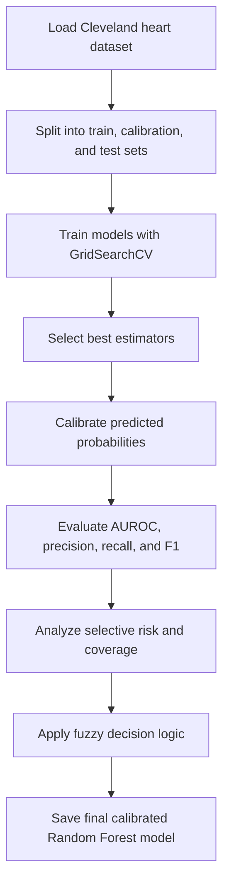

# Heart Disease Risk Prediction

A pattern-recognition and machine-learning project for predicting heart disease presence from Cleveland heart disease clinical features. The project compares multiple classifiers, evaluates calibrated probabilities, explores selective prediction trade-offs, and includes a simple web form for sending patient feature inputs to a prediction API.

## Suggested GitHub Repository Details

**Repository name:** `heart-disease-risk-prediction`

**GitHub description:**

> Machine learning project for heart disease prediction using the Cleveland dataset, calibrated classifiers, selective-risk analysis, and a simple web prediction interface.

Alternative names:

- `heart-disease-pattern-recognition`
- `cleveland-heart-disease-ml`
- `cardio-risk-prediction-ml`

## Project Overview

This project uses the Cleveland heart disease dataset to train and evaluate binary classification models for predicting the `condition` target:

- `0` = no heart disease
- `1` = heart disease present

The notebook experiments with several machine-learning models, calibrates their probability outputs, and studies confidence-based decision making where the model can abstain from uncertain predictions.

## Features

- Loads and explores the Cleveland heart disease dataset.
- Splits data into training, calibration, and test sets using stratified sampling.
- Trains and tunes multiple classifiers with cross-validation:
  - Logistic Regression
  - Support Vector Machine
  - Random Forest
  - Gradient Boosting
- Evaluates models using:
  - AUROC
  - Precision
  - Recall
  - F1-score
  - Confusion-matrix-based selective metrics
- Applies probability calibration using `CalibratedClassifierCV`.
- Analyzes selective prediction with confidence thresholds.
- Implements a fuzzy decision layer for low / medium / high risk probability regions.
- Saves the final calibrated Random Forest model with `joblib`.
- Provides a basic HTML form for prediction input.

## Repository Structure

```text
.
├── README.md
├── heart_cleveland_upload.csv   # Cleveland heart disease dataset
├── index.html                   # Simple web UI for prediction input
└── main.ipynb                   # Model training, evaluation, calibration, and export notebook
```

## Dataset

The dataset file is `heart_cleveland_upload.csv` and contains 297 records with 13 input features and 1 target column.

### Input Features

| Column | Description |
| --- | --- |
| `age` | Age in years |
| `sex` | Sex of the patient |
| `cp` | Chest pain type |
| `trestbps` | Resting blood pressure |
| `chol` | Serum cholesterol |
| `fbs` | Fasting blood sugar greater than 120 mg/dL |
| `restecg` | Resting ECG result |
| `thalach` | Maximum heart rate achieved |
| `exang` | Exercise-induced angina |
| `oldpeak` | ST depression induced by exercise |
| `slope` | Slope of the peak exercise ST segment |
| `ca` | Number of major vessels colored by fluoroscopy |
| `thal` | Thalassemia category |

### Target

| Column | Description |
| --- | --- |
| `condition` | Binary heart disease label: `0` = no disease, `1` = disease |

## Model Workflow



## Results

Stored notebook outputs show the following test-set performance:

| Model | AUROC | Precision | Recall | F1-score |
| --- | ---: | ---: | ---: | ---: |
| Logistic Regression | 0.9308 | 1.0000 | 0.8214 | 0.9020 |
| SVM | 0.9275 | 1.0000 | 0.7857 | 0.8800 |
| Random Forest | 0.9286 | 0.8750 | 0.7500 | 0.8077 |
| Gradient Boosting | 0.9252 | 0.9130 | 0.7500 | 0.8235 |

The final exported model in the notebook is the calibrated Random Forest model:

```python
saved_models/final_calibrated_rf.pkl
```

The fuzzy decision layer achieved approximately:

- Coverage: `0.6167`
- False Negative Rate: `0.0556`

> Note: These results are based on the current notebook outputs and may change if the notebook is rerun with different library versions, parameters, or data splits.

## Installation

Create and activate a Python environment:

```bash
python -m venv .venv
source .venv/bin/activate
```

Install the required packages:

```bash
pip install numpy pandas matplotlib scikit-learn joblib jupyter
```

## Running the Notebook

Start Jupyter Notebook:

```bash
jupyter notebook
```

Open:

```text
main.ipynb
```

The notebook currently reads the dataset from a Google Drive path:

```python
df = pd.read_csv('/content/drive/MyDrive/PatternRecog/heart_cleveland_upload.csv')
```

For local usage, change it to:

```python
df = pd.read_csv('heart_cleveland_upload.csv')
```

Then run all cells to train, evaluate, calibrate, and export the model.

## Web Prediction Interface

`index.html` contains a simple form for entering patient feature values. When the **Predict** button is clicked, the form sends a JSON request to a configured prediction API endpoint.

Expected request body format:

```json
{
  "age": 55,
  "sex": 1,
  "cp": 2,
  "trestbps": 130,
  "chol": 250,
  "fbs": 0,
  "restecg": 0,
  "thalach": 150,
  "exang": 0,
  "oldpeak": 1.2,
  "slope": 1,
  "ca": 0,
  "thal": 2
}
```

Open the page directly in a browser:

```bash
xdg-open index.html
```

Or serve it locally:

```bash
python -m http.server 8000
```

Then visit:

```text
http://localhost:8000/index.html
```

## Technologies Used

- Python
- NumPy
- Pandas
- Matplotlib
- Scikit-learn
- Joblib
- HTML, CSS, JavaScript

## Important Note

This project is intended for educational and research purposes only. It should not be used as a medical diagnosis tool. Any real-world healthcare decision should be made by qualified medical professionals using validated clinical systems.

## License

No license has been specified yet. Add a license file before publishing if you want others to use, modify, or distribute this project.
